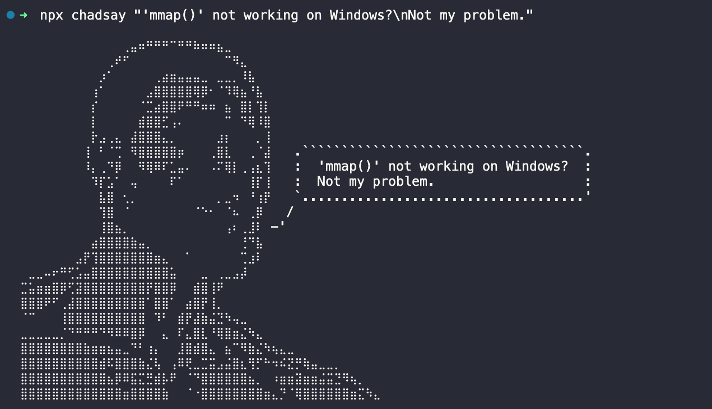

# chadsay.js

> Less cows, more chads.



## Usage
Without arguments to get a random message:
```sh
npx chadsay
```

One argument as a message:
```sh
npx chadsay "'mmap()' not working on Windows?\nNot my problem."
```

Help text:
```sh
npx chadsay --help
```

### In a script
```sh
npm i chadsay
```

```javascript
import chadsay from 'chadsay'

console.log(chadsay()) // Get a random message
console.log(chadsay('A one-liner example.'))
console.log(chadsay(['A multi-line', 'example.']))
```

## Original version
This project is the JavaScript version of @agvxov's work:<br />
https://github.com/agvxov/chadsay